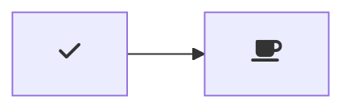

Keyboard Shortcuts
Table
Key	Command
Ctrl/Cmd + B	Toggle bold
Ctrl/Cmd + I	Toggle italic
Alt+S (on Windows)	Toggle strikethrough1
Ctrl + Shift + ]	Toggle heading (uplevel)
Ctrl + Shift + [	Toggle heading (downlevel)
Ctrl/Cmd + M	Toggle math environment
Alt + C	Check/Uncheck task list item
Ctrl/Cmd + Shift + V	Toggle preview
Ctrl/Cmd + K V	Toggle preview to side

-----

## Marmeaid

````mermaid
graph TD;
    A-->B;
    A-->C;
    B-->D;
    C-->D;
`
Settings
Key	Command: Description


ID	Description	Default
markdown-mermaid.darkModeTheme

Default Mermaid theme for dark mode.

"dark"
markdown-mermaid.languages

Default languages in markdown.

[
  "mermaid"
]
markdown-mermaid.lightModeTheme

Default Mermaid theme for light mode.

"default"
markdown-mermaid.maxTextSize

The maximum allowed size of the users text diagram.

50000

````

Usage
Create diagrams in markdown using mermaid fenced code blocks:


You can also use ::: blocks:

::: mermaid
graph TD;
    A-->B;
    A-->C;
    B-->D;
    C-->D;
:::

Supports MDI and logos icons from Iconify:

```mermaid
architecture-beta
    service user(mdi:account)
    service lambda(logos:aws-lambda)

    user:R --> L:lambda
```



Configuration
markdown-mermaid.lightModeTheme — Configures the Mermaid theme used when VS Code is using a light color theme. Supported values are: "base", "forest", "dark", "default", "neutral". Currently not supported in notebooks.

markdown-mermaid.darkModeTheme — Configures the Mermaid theme used when VS Code is using a dark color theme. Supported values are: "base", "forest", "dark", "default", "neutral". Currently not supported in notebooks.

markdown-mermaid.languages — Configures language ids for Mermaid code blocks. The default is ["mermaid"].

Using custom CSS in the Markdown Preview
You can use the built-in functionality to add custom CSS. More info can be found in the markdown.styles documentation

For example, add Font Awesome like this:

"markdown.styles": [
    "https://use.fontawesome.com/releases/v5.7.1/css/all.css"
]

Use it like this:



----

You can show and hide icons in the title bar with the markdownShortcuts.icons.* config settings.

Exposed Commands
Name	Description	Default key binding
md-shortcut.showCommandPalette	Display all commands	ctrl+M ctrl+M
md-shortcut.toggleBold	Make **bold**	ctrl+B
md-shortcut.toggleItalic	Make _italic_	ctrl+I
md-shortcut.toggleStrikethrough	Make ~~strikethrough~~
md-shortcut.toggleLink	Make [a hyperlink](www.example.org)	ctrl+L
md-shortcut.toggleImage	Make an image 	ctrl+shift+L
md-shortcut.toggleCodeBlock	Make ```a code block```	ctrl+M ctrl+C
md-shortcut.toggleInlineCode	Make `inline code`	ctrl+M ctrl+I
md-shortcut.toggleBullets	Make * bullet point	ctrl+M ctrl+B
md-shortcut.toggleNumbers	Make 1. numbered list	ctrl+M ctrl+1
md-shortcut.toggleCheckboxes	Make - [ ] check list (Github flavored markdown)	ctrl+M ctrl+X
md-shortcut.toggleTitleH1	Toggle # H1 title
md-shortcut.toggleTitleH2	Toggle ## H2 title
md-shortcut.toggleTitleH3	Toggle ### H3 title
md-shortcut.toggleTitleH4	Toggle #### H4 title
md-shortcut.toggleTitleH5	Toggle ##### H5 title
md-shortcut.toggleTitleH6	Toggle ###### H6 title
md-shortcut.addTable	Add Tabular values
md-shortcut.addTableWithHeader	Add Tabular values with header
<!-- @import "[TOC]" {cmd="toc" depthFrom=1 depthTo=6 orderedList=false} -->


